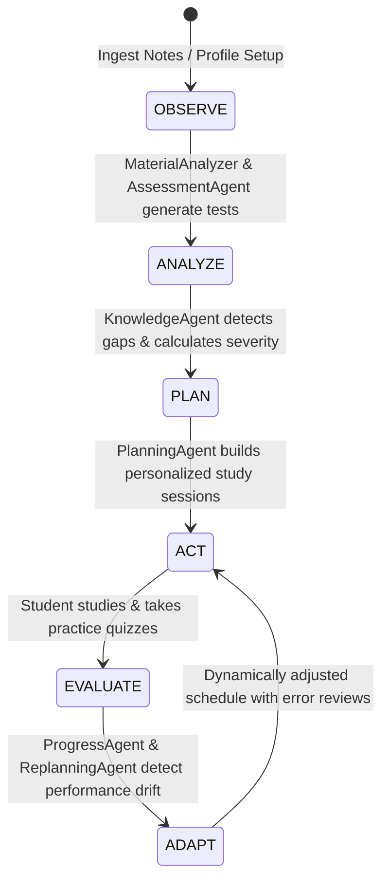

# StudyGapRadar 🎯
### Autonomous Multi-Agent Academic Diagnostic, Knowledge-Gap Detection & Adaptive Learning Platform

StudyGapRadar is a full-stack, AI-powered academic learning companion designed for engineering and university students. It replaces static study schedules with an autonomous multi-agent intelligence system that ingests syllabus documents and lecture notes via PyMuPDF, conducts rigorous diagnostic assessments, maps personalized knowledge gaps with mathematical priority scoring, generates adaptive daily study calendars, provides context-aware tutoring grounded in uploaded materials, and dynamically reschedules study plans upon performance drift.

---

## Table of Contents
1. [Academic Problem Statement & Solution](#academic-problem-statement--solution)
2. [Key Capabilities](#key-capabilities)
3. [System Architecture](#system-architecture)
4. [Autonomous Multi-Agent Architecture](#autonomous-multi-agent-architecture)
5. [Tech Stack](#tech-stack)
6. [Database Schema](#database-schema)
7. [REST API Endpoint Reference](#rest-api-endpoint-reference)
8. [Installation & Setup](#installation--setup)
9. [Starting the Application](#starting-the-application)
10. [Pre-Seeded Demo Credentials](#pre-seeded-demo-credentials)
11. [Running Test Suites & Verification](#running-test-suites--verification)
12. [Academic Demo Walkthrough](#academic-demo-walkthrough)
13. [Environment Configuration](#environment-configuration)
14. [Troubleshooting](#troubleshooting)

---

## Academic Problem Statement & Solution

### The Challenge
University students facing high-stakes examinations (e.g., Data Structures & Algorithms, Operating Systems, GATE, Finals) struggle with **illusions of competence**, unstructured cramming, and inability to quantify specific concept-level weaknesses. Existing platforms either present static question banks without syllabus context, or offer generic calendar tools disconnected from actual student retention and test scores.

### The StudyGapRadar Solution
StudyGapRadar introduces an autonomous closed-loop agentic learning pipeline:
1. **Material Ingestion**: Upload course PDFs or lecture notes. Documents are parsed, indexed, and chunked with semantic sliding windows.
2. **Diagnostic Assessment**: Students take tailored multi-topic diagnostic tests.
3. **Mathematical Gap Analysis**: Knowledge gaps are ranked using a composite priority metric:
   $$\text{Priority Score} = 0.70 \times \text{Gap Severity} + 0.30 \times \text{Topic Urgency}$$
4. **Adaptive Study Scheduling**: A dynamic planner generates daily calendar sessions tailored to remaining days before the exam and available daily hours.
5. **Notes-Aware RAG Tutor**: An intelligent AI tutor answers student questions, citing directly from their uploaded textbook or notes with hybrid fallback.
6. **Adaptive Replanning**: When a student scores low on practice quizzes, the Replanning Agent automatically restructures the study schedule, reallocating time toward deficient concepts without disrupting the overall exam target.

---

## Key Capabilities

- **100% Preserved Modern UI**: Intuitive, high-performance React + Tailwind CSS dashboard with dark theme, responsive layouts, animated progress bars, Lucide icons, and Recharts analytics.
- **8 Autonomous Specialized Agents**: Coordinated by an Orchestrator Agent operating on an `Observe -> Analyze -> Plan -> Act -> Evaluate -> Adapt` feedback loop.
- **FastAPI Python Backend**: Clean modular architecture with Pydantic validation, dependency injection, and SQLite WAL database persistence.
- **PyMuPDF Document Ingestion**: Ingests PDF lecture notes or raw text notes, creates clean text chunks, and binds them to curriculum topics.
- **Hybrid AI Tutor Engine**: Grounded retrieval over uploaded course notes with intelligent local domain-engine fallback when OpenAI API keys are not configured or offline.
- **Live Agent Activity Stream**: Auditable, real-time logging of all agent thoughts, decisions, score calculations, and replanning triggers.

---

## System Architecture

```
+---------------------------------------------------------------------------------+
|                               React 18 + Vite Frontend                           |
|                      (Tailwind CSS, Lucide React, Recharts)                     |
|                               http://localhost:5173                             |
+---------------------------------------------------------------------------------+
                                      |
                            Axios REST API Requests
                                      v
+---------------------------------------------------------------------------------+
|                           FastAPI Python 3.13 Backend                           |
|                               http://localhost:8000                             |
+---------------------------------------------------------------------------------+
|  Routers:                                                                       |
|   - /api/auth          - /api/profile        - /api/materials                   |
|   - /api/diagnostic    - /api/knowledge      - /api/plan                        |
|   - /api/quiz          - /api/tutor          - /api/progress                    |
|   - /api/analytics     - /api/agents         - /api/reports                     |
+---------------------------------------------------------------------------------+
                                      |
          +---------------------------+---------------------------+
          |                                                       |
          v                                                       v
+-----------------------------+               +-----------------------------------+
|     8 Specialized Agents    |               |         Core Services Layer       |
+-----------------------------+               +-----------------------------------+
| 1. OrchestratorAgent        |               | - pdf_service (PyMuPDF)           |
| 2. MaterialAnalyzerAgent    |               | - retrieval_service (TF-IDF RAG)  |
| 3. AssessmentAgent          |               | - material_service                |
| 4. KnowledgeAgent           |               | - assessment_service              |
| 5. PlanningAgent            |               | - planning_service                |
| 6. TutorAgent               |               | - progress_service                |
| 7. ProgressAgent            |               +-----------------------------------+
| 8. ReplanningAgent          |                                   |
+-----------------------------+                                   |
          |                                                       |
          +---------------------------+---------------------------+
                                      |
                                      v
+---------------------------------------------------------------------------------+
|                       SQLite Database (studygapradar.db)                        |
|                    WAL Mode - 14 Relational ORM Entities                        |
+---------------------------------------------------------------------------------+
```

---

## Autonomous Multi-Agent Architecture



### Agent Roles & Responsibilities

| Agent Name | Primary Responsibility | Input Triggers | Output Artifacts |
| :--- | :--- | :--- | :--- |
| **OrchestratorAgent** | Coordinates multi-agent lifecycle, routes requests, logs events | User actions, system triggers | System state transitions, agent event logs |
| **MaterialAnalyzerAgent** | Ingests PDF/text notes via PyMuPDF, extracts curriculum topics | Document upload (`/api/materials/*`) | `MaterialChunk` records, topic mappings |
| **AssessmentAgent** | Dynamically curates diagnostic and practice assessment queues | Diagnostic start, topic selection | Tailored 4-choice questions, attempt sessions |
| **KnowledgeAgent** | Evaluates mastery status, computes weighted gap priority scores | Diagnostic submission | `TopicMastery` records (Mastered, Solid, Needs-Attention, Critical) |
| **PlanningAgent** | Allocates daily study sessions according to exam timeline and hours | Onboarding complete, diagnostic finish | Structured `StudyPlan` & calendar `StudySession` entries |
| **TutorAgent** | Answers conceptual questions with semantic citations to notes | Student query (`/api/tutor/ask`) | Citations, explanations, formulas, analogies |
| **ProgressAgent** | Tracks completed sessions, calculates completion % and streaks | Session completion, quiz submissions | Daily streak updates, live dashboard analytics |
| **ReplanningAgent** | Monitors quiz performance drift; adapts schedule automatically | Low quiz score ($< 70\%$) | Modified `StudySession` priorities & error-review slots |

---

## Tech Stack

### Frontend
- **Framework**: React 18 with TypeScript
- **Build Tool**: Vite
- **Styling**: Tailwind CSS, PostCSS, Autoprefixer
- **UI Components & Icons**: Lucide React, Custom Glassmorphic Dark Theme
- **Data Visualizations**: Recharts (ResponsiveContainer, AreaChart, BarChart, PieChart)
- **Routing**: React Router DOM v6
- **Date Formatting**: date-fns

### Backend
- **Framework**: Python 3.10+ / FastAPI
- **Server**: Uvicorn ASGI
- **Validation**: Pydantic v2
- **ORM & Database**: SQLAlchemy 2.0 with SQLite 3 (WAL mode enabled)
- **PDF Extraction**: PyMuPDF (`pymupdf` v1.25+)
- **Information Retrieval**: TF-IDF Vector Space RAG (`scikit-learn` / custom vectorizer)
- **Security**: PBKDF2-HMAC-SHA256 password hashing, HMAC-SHA256 signed bearer tokens
- **AI & LLM**: OpenAI GPT API with graceful fallback to built-in pedagogical knowledge engine

---

## Database Schema

The platform utilizes 14 relational tables stored in `studygapradar.db`:

1. **`users`**: `id`, `email` (unique), `password_hash`, `name`, `created_at`.
2. **`profiles`**: `id`, `user_id` (FK), `branch`, `semester`, `subject`, `exam_name`, `exam_date`, `daily_study_hours`, `current_confidence`, `learning_goal`, `created_at`, `updated_at`.
3. **`subjects`**: `id`, `name`, `code`, `user_id` (FK).
4. **`topics`**: `id`, `subject_id` (FK), `name`, `description`, `importance_weight`, `order_index`.
5. **`concepts`**: `id`, `topic_id` (FK), `name`, `summary`, `difficulty_level`.
6. **`materials`**: `id`, `user_id` (FK), `subject_id` (FK), `title`, `filename`, `file_type`, `file_size`, `total_pages`, `extracted_text`, `created_at`.
7. **`material_chunks`**: `id`, `material_id` (FK), `topic_id` (FK), `chunk_index`, `content`, `token_count`.
8. **`questions`**: `id`, `topic_id` (FK), `concept_id` (FK), `prompt`, `option_a`, `option_b`, `option_c`, `option_d`, `correct_option`, `explanation`, `difficulty`, `discrimination_index`.
9. **`assessment_attempts`**: `id`, `user_id` (FK), `assessment_type`, `subject_id` (FK), `score`, `total_questions`, `started_at`, `completed_at`.
10. **`assessment_answers`**: `id`, `attempt_id` (FK), `question_id` (FK), `selected_option`, `is_correct`, `time_spent_seconds`.
11. **`topic_mastery`**: `id`, `user_id` (FK), `topic_id` (FK), `mastery_score`, `confidence_level`, `gap_severity`, `priority_score`, `status`, `last_assessed`.
12. **`study_plans`**: `id`, `user_id` (FK), `subject_id` (FK), `title`, `start_date`, `exam_date`, `daily_hours_allocated`, `status`.
13. **`study_sessions`**: `id`, `plan_id` (FK), `topic_id` (FK), `date`, `duration_minutes`, `activity_type`, `is_completed`, `completed_at`, `notes`.
14. **`quiz_attempts`**: `id`, `user_id` (FK), `topic_id` (FK), `score`, `total_questions`, `percentage`, `replan_triggered`, `created_at`.
15. **`progress_logs`**: `id`, `user_id` (FK), `date`, `minutes_studied`, `sessions_completed`, `streak_count`.
16. **`agent_events`**: `id`, `user_id` (FK), `agent_name`, `action`, `detail`, `metadata_json`, `timestamp`.
17. **`question_reports`**: `id`, `user_id` (FK), `question_id` (FK), `reason`, `comment`, `created_at`.

---

## REST API Endpoint Reference

All endpoints are served under `/api` with automatic Swagger UI interactive documentation at `http://localhost:8000/docs`.

| Method | Endpoint | Description | Auth Required |
| :--- | :--- | :--- | :---: |
| `POST` | `/api/auth/signup` | Register student with name, email, password | No |
| `POST` | `/api/auth/login` | Authenticate student, return JWT Bearer token | No |
| `GET` | `/api/auth/me` | Fetch authenticated student profile | **Yes** |
| `GET` | `/api/profile` | Retrieve student academic profile and goals | **Yes** |
| `PUT` | `/api/profile` | Update branch, semester, exam date, daily hours | **Yes** |
| `POST` | `/api/materials/upload` | Upload PDF course notes via PyMuPDF | **Yes** |
| `POST` | `/api/materials/text` | Ingest raw text notes into semantic chunks | **Yes** |
| `GET` | `/api/materials` | List all ingested materials and chunk counts | **Yes** |
| `POST` | `/api/diagnostic/generate` | Generate diagnostic assessment questions | **Yes** |
| `POST` | `/api/diagnostic/submit` | Submit diagnostic responses, score mastery | **Yes** |
| `GET` | `/api/knowledge/results` | Fetch topic gap analysis & priority scores | **Yes** |
| `POST` | `/api/plan/generate` | Generate personalized multi-day study schedule | **Yes** |
| `GET` | `/api/plan` | Retrieve active study plan and daily sessions | **Yes** |
| `POST` | `/api/quiz/generate` | Generate targeted 4-question topic quiz | **Yes** |
| `POST` | `/api/quiz/submit` | Submit quiz; trigger ReplanningAgent if low | **Yes** |
| `POST` | `/api/tutor/ask` | Query AI Tutor with course notes RAG retrieval | **Yes** |
| `POST` | `/api/progress/session` | Mark scheduled study session complete | **Yes** |
| `GET` | `/api/analytics/dashboard` | Fetch dashboard stats, mastery %, and streak | **Yes** |
| `GET` | `/api/agents/events` | Stream live autonomous agent events | **Yes** |
| `POST` | `/api/reports/question` | Report inaccurate or ambiguous question | **Yes** |
| `GET` | `/api/reports/user` | Fetch student question reports | **Yes** |

---

## Installation & Setup

### Prerequisites
- **Python**: Version 3.10, 3.11, 3.12, or 3.13 installed
- **Node.js**: Version 18.x or higher, with `npm`

### Step 1: Clone or Navigate to Project Directory
```bash
cd project-bolt-sb1-78ckjmr7
```

### Step 2: Install Backend Dependencies
```bash
pip install -r requirements.txt
```
*(Dependencies include: `fastapi`, `uvicorn`, `pydantic`, `sqlalchemy`, `pymupdf`, `scikit-learn`, `requests`, `python-dotenv`)*

### Step 3: Install Frontend Dependencies
```bash
cd project
npm install
cd ..
```

---

## Starting the Application

StudyGapRadar runs with two concurrently active terminals:

### Terminal 1 — Backend Server (FastAPI + Uvicorn)
From the project root:
```bash
python -m uvicorn backend.main:app --port 8000 --reload
```
- **Backend API**: `http://localhost:8000`
- **Interactive Swagger Docs**: `http://localhost:8000/docs`
- **Database File**: `studygapradar.db` (auto-created and seeded upon first launch)

### Terminal 2 — Frontend Dev Server (React + Vite)
From the `project/` directory:
```bash
cd project
npm run dev
```
- **Frontend App**: `http://localhost:5173`

---

## Pre-Seeded Demo Credentials

A comprehensive pre-seeded student account is included out of the box:

| Field | Value |
| :--- | :--- |
| **Email** | `demo@studygapradar.app` |
| **Password** | `demo12345` |
| **Student Name** | Aarav Sharma |
| **Branch** | Computer Science & Engineering |
| **Target Exam** | Final Examination (Data Structures) |

*You can also register any new account on the Sign Up page at `http://localhost:5173/signup`.*

---

## Running Test Suites & Verification

### 1. Backend API Comprehensive Test Suite
Validates authentication, profile updating, PyMuPDF text ingestion, diagnostic evaluation, study plan generation, practice quiz scoring, RAG AI tutor, and question reporting:
```bash
python -m backend.tests.test_api
```
**Expected Result**:
```
Running StudyGapRadar Full-Stack API Test Suite...
============================================================
PASS: Auth & Profile
PASS: Material Ingestion
PASS: Diagnostic Assessment
PASS: Knowledge Gap Results & Study Plan
PASS: Practice Quiz & Replanning
PASS: AI Tutor with RAG Context
PASS: Dashboard Analytics & Agent Events
============================================================
All 7 API test suites PASSED successfully!
```

### 2. End-to-End Academic Demo Flow Test
Runs a complete student journey simulating the full academic scenario:
```bash
python backend/tests/test_academic_demo.py
```
**Expected Result**:
```
=======================================================
STARTING STUDYGAPRADAR FULL-STACK ACADEMIC DEMO FLOW
=======================================================
1. Registering new student: student_... [OK]
2. Setting up student onboarding profile... [OK]
3. Ingesting Data Structures Study Notes... [OK]
4. Initiating Diagnostic Assessment on Data Structures topics... [OK]
5. Submitting student diagnostic responses... [OK]
6. Verifying Planning Agent personalized schedule... [OK]
7. Progress Agent: Student completes session... [OK]
8. Student takes a Trees quiz and scores low... [OK]
   - Replanning Agent Triggered: True
9. Asking AI Tutor: Citing uploaded notes: True [OK]
10. Checking live Dashboard Analytics & Agent Event Stream... [OK]
=======================================================
ACADEMIC DEMO SCENARIO FULLY VALIDATED AND PASSED! [OK]
=======================================================
```

### 3. Frontend Production Build Verification
```bash
cd project
npm run build
```
**Expected Result**:
```
vite v5.4.2 building for production...
✓ 1878 modules transformed.
dist/index.html                   0.48 kB │ gzip:  0.31 kB
dist/assets/index-D8Y33V2g.css   27.75 kB │ gzip:  5.49 kB
dist/assets/index-DEe-q-4P.js   473.08 kB │ gzip: 147.05 kB
✓ built in 27.92s
```

---

## Academic Demo Walkthrough

Follow this step-by-step procedure to showcase the platform in an academic presentation or live evaluation:

### Step 1: Sign In
1. Open `http://localhost:5173` in your browser.
2. Sign in with `demo@studygapradar.app` and `demo12345` (or click "Sign up" to create a new profile).
3. The dashboard loads with Aarav's live progress, daily streak, target exam date, and today's schedule.

### Step 2: Upload Lecture Notes (Material Analyzer Agent)
1. In the left navigation, click **AI Tools**.
2. Under **Course Material Ingestion**, upload a PDF notes file or paste text notes on Binary Trees and click **Upload & Analyze Document**.
3. Observe the live summary showing chunks created and topics mapped.

### Step 3: Run Diagnostic Assessment (Assessment & Knowledge Agents)
1. Navigate to **Diagnostic**.
2. Select your topics (Arrays, Linked Lists, Trees, Recursion) and target exam date, then click **Start Diagnostic**.
3. Answer the diagnostic questions. Deliberately select incorrect answers for "Trees".
4. Submit the test. The **Knowledge Gap Results** page appears immediately:
   - "Trees" is highlighted with a high priority score and status `Needs Attention`.
   - "Arrays" shows `Solid` or `Mastered`.

### Step 4: Study Plan & Daily Schedule (Planning Agent)
1. Return to the **Dashboard**.
2. Notice the dynamically generated calendar sessions. The Planning Agent has scheduled high-priority sessions for Trees and Recursion earlier in the week.
3. Click **Mark Done** on a scheduled session. Watch your completion percentage and study streak update in real-time.

### Step 5: Practice Quiz & Adaptive Replanning (Replanning Agent)
1. Go to **Practice**.
2. Select **Trees** and take the 4-question targeted quiz.
3. Choose wrong answers to simulate struggling with tree traversals.
4. Submit the quiz. The **Quiz Results** page displays:
   - Score: `0/4 (0%)`
   - Yellow alert box: **Adaptive Replanning Triggered!**
   - The Replanning Agent automatically inserted extra concept review sessions into your calendar.

### Step 6: Ask the Notes-Aware AI Tutor (Tutor Agent)
1. Navigate to **AI Tools** -> **Notes-Aware AI Tutor**.
2. Select topic **Trees** and mode **Explain Simply**.
3. Ask: *"Explain binary tree traversal like I'm a beginner."*
4. The tutor responds using the concepts extracted from your uploaded lecture notes, citing the exact context.

### Step 7: Inspect Autonomous Agent Activity Stream
1. Scroll down in **AI Tools** to the **Autonomous Agent Activity Stream**.
2. View the complete real-time audit log of every agent action:
   - `[MaterialAnalyzerAgent]` Extracted topics and created chunks
   - `[AssessmentAgent]` Generated diagnostic questions
   - `[KnowledgeAgent]` Calculated priority scores
   - `[PlanningAgent]` Built personalized study calendar
   - `[ReplanningAgent]` Adapted schedule due to quiz performance drift
   - `[TutorAgent]` Responded to question using course notes RAG

---

## Environment Configuration

Configuration is stored in `.env` in the root workspace. A template is provided in `.env.example`:

```env
# Server Configuration
PORT=8000
HOST=127.0.0.1
CORS_ORIGINS=http://localhost:5173,http://127.0.0.1:5173

# Database
DATABASE_URL=sqlite:///./studygapradar.db

# Authentication Security
JWT_SECRET_KEY=studygapradar-super-secret-academic-key-change-in-production
ACCESS_TOKEN_EXPIRE_MINUTES=1440

# AI Configuration (Optional - fallback domain engine activates automatically if omitted)
OPENAI_API_KEY=
OPENAI_MODEL=gpt-4o-mini
```

---

## Troubleshooting

### 1. Port 8000 or 5173 Already in Use
- If port 8000 is occupied: `python -m uvicorn backend.main:app --port 8001` (update `VITE_API_URL=http://localhost:8001/api` in `project/.env`).
- If port 5173 is occupied, Vite will automatically prompt to use port 5174.

### 2. PyMuPDF Installation on Windows
If `pip install pymupdf` fails on older environments:
```bash
python -m pip install --upgrade pip setuptools wheel
pip install pymupdf
```

### 3. SQLite Database Reset
If you ever want to reset the database to a fresh state:
1. Stop the backend server.
2. Delete `studygapradar.db`.
3. Restart the backend server with `python -m uvicorn backend.main:app --port 8000`. The tables and demo account will automatically re-seed.

---

## License & Academic Citation
This project was developed for academic research and evaluation in Autonomous Multi-Agent Educational Technology. All rights reserved.
